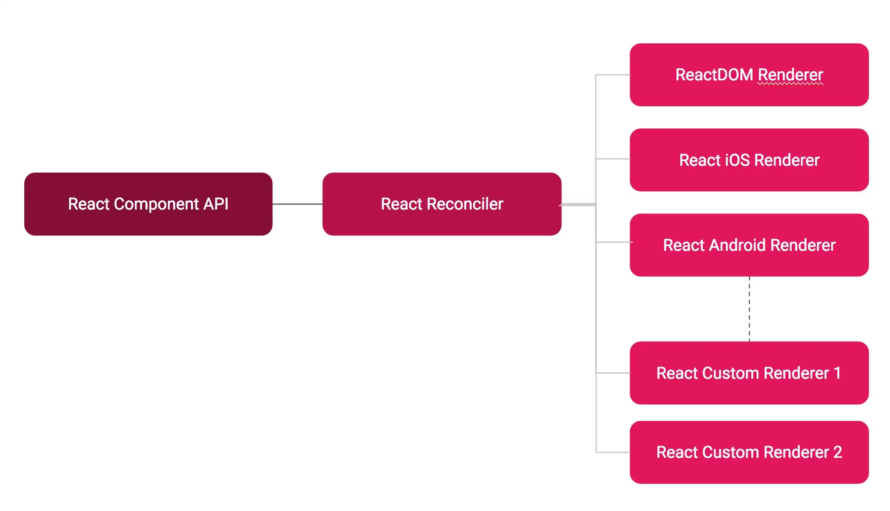

# 使用 react-reconciler 编写自己的渲染器


React 中有 3 个基本块：

1. React Component API：提供组件API和生命周期
2. React-Reconciler：它是管理声明式 UI 背后的命令式更新的核心差异算法。Reconciler 是计算应用程序 UI 不同状态之间的变化并在幕后应用这些变化的主力军。可以在[https://reactjs.org/docs/reconciliation.html](https://reactjs.org/docs/reconciliation.html)阅读更多关于协调的信息
3. React Renderer：渲染器只不过是 `react-reconciler` 所需的一些功能的实现。`react-reconciler` 将根据需要调用这些函数以将更改更新到最终目标。如果您使用 DOM API 实现这些功能，目标就是 Web。如果您使用 iOS UI Kit API 实现这些功能，则目标是 iOS。如果您使用 Android UI API 实现这些功能，则目标是 Android。事实上，任何支持绘图的系统都可以作为 React 的渲染目标。好吧，它甚至不必是要画的东西。抽象是疯狂的。



[react-reconciler](https://github.com/facebook/react/tree/main/packages/react-reconciler) **在React 16 中被完全重写，有一个更好的实现，称为 React Fiber**。在 React Fiber 之前，Reconciler 是紧耦合的。现在它是解耦的，编写自定义渲染器更容易。`react-reconciler` API 不遵循与 react 的公共 API 相同的保证，因为它不断被调整。

## 自定义渲染器

1. 使用 `create-react-app` 创建一个新的 React 项目并启动它。

```sh
create-react-app hello-react-custom-renderer
cd hello-react-custom-renderer
yarn start
```

2. 让我们用自定义的渲染器替换掉 `react-dom` 的渲染器。

```js
import React from 'react';
// import ReactDOM from 'react-dom';
import MyCustomRenderer from './myCustomRenderer';
import './index.css';
import App from './App';
// ReactDOM.render(<App />, document.getElementById('root'));
MyCustomRenderer.render(<App />, document.getElementById('root'));
```

3. 将 `react-reconciler` 包添加到项目中。`yarn add react-reconciler`

创建一个 `myCustomRenderer.js` 以代码命名的新文件，如下所示。渲染函数是渲染器需要实现的唯一公共接口。在此内部，我们使用 `react-reconciler`。

```js
import ReactReconciler from 'react-reconciler';

const hostConfig = {};
const ReactReconcilerInst = ReactReconciler(hostConfig);
export default {
  render: (reactElement, domElement, callback) => {
    console.log(arguments);
    // Create a root Container if it doesnt exist
    if (!domElement._rootContainer) {
      domElement._rootContainer = ReactReconcilerInst.createContainer(domElement, false);
    }

    // update the root Container
    return ReactReconcilerInst.updateContainer(reactElement, domElement._rootContainer, null, callback);
  }
};
```

在我们的 `index.js` 中，我们将渲染函数用作

```js
MyCustomRenderer.render(<App />, document.getElementById('root'));
```

这个渲染函数有 3 个参数，`reactElement` 在我们的例子中它是我们的 `App` 组件。是具有将呈现到其中 `domElement` 的 `id` 的 DOM 元素。第三个参数是可选的，在组件渲染或更新后调用。在我们的例子中，我们忽略了这一点。

`hostConfig` 是我们需要实现将由 `ReactReconciler` 使用的函数的对象。可以在 `react-reconciler` 的[官方文档](https://github.com/facebook/react/tree/main/packages/react-reconciler#an-incomplete-reference)中看到它的定义。

最终我们自定义渲染器的代码如下：

```js
import ReactReconciler from 'react-reconciler';

const rootHostContext = {};
const childHostContext = {};

const hostConfig = {
  now: Date.now,
  getRootHostContext: () => {
    return rootHostContext;
  },
  prepareForCommit: () => { },
  resetAfterCommit: () => { },
  getChildHostContext: () => {
    return childHostContext;
  },
  shouldSetTextContent: (type, props) => {
    return typeof props.children === 'string' || typeof props.children === 'number';
  },
  /**
   这是 react-reconciler 想要根据目标创建 UI 元素实例的地方。由于我们的目标是 DOM，我们将创建 document.createElement 并且 type 是包含类型字符串的参数，如 div 或 img 或 h1 等。domElement 属性的初始值可以在此函数中从 newProps 参数设置
   */
  createInstance: (type, newProps, rootContainerInstance, _currentHostContext, workInProgress) => {
    const domElement = document.createElement(type);
    Object.keys(newProps).forEach(propName => {
      const propValue = newProps[propName];
      if (propName === 'children') {
        if (typeof propValue === 'string' || typeof propValue === 'number') {
          domElement.textContent = propValue;
        }
      } else if (propName === 'onClick') {
        domElement.addEventListener('click', propValue);
      } else if (propName === 'className') {
        domElement.setAttribute('class', propValue);
      } else {
        const propValue = newProps[propName];
        domElement.setAttribute(propName, propValue);
      }
    });
    return domElement;
  },
  /** 如果目标只允许在单独的文本节点中创建文本，则此函数用于创建单独的文本节点。 */
  createTextInstance: text => {
    return document.createTextNode(text);
  },
  /** 映射到 domElement.appendChild。此函数被调用以创建初始 UI 树。 */
  appendInitialChild: (parent, child) => {
    parent.appendChild(child);
  },
  /** 映射到 domElement.appendChild。类似于 appendInitialChild 但用于后续的树操作。 */
  appendChild(parent, child) {
    parent.appendChild(child);
  },
  finalizeInitialChildren: (domElement, type, props) => { },
  supportsMutation: true,
  /** 映射到 domElement.appendChild。在 react-reconciler 的 commitPhase 中被调用 */
  appendChildToContainer: (parent, child) => {
    parent.appendChild(child);
  },
  /** 这是我们想要区分 oldProps 和 newProps 并决定是否更新的地方。在我们的实现中，为简单起见，我们只是将其设置为 true。 */
  prepareUpdate(domElement, oldProps, newProps) {
    return true;
  },
  /** 此函数用于随后根据值更新domElement属性。newProps */
  commitUpdate(domElement, updatePayload, type, oldProps, newProps) {
    Object.keys(newProps).forEach(propName => {
      const propValue = newProps[propName];
      if (propName === 'children') {
        if (typeof propValue === 'string' || typeof propValue === 'number') {
          domElement.textContent = propValue;
        }
      } else {
        const propValue = newProps[propName];
        domElement.setAttribute(propName, propValue);
      }
    });
  },
  commitTextUpdate(textInstance, oldText, newText) {
    textInstance.text = newText;
  },
  /** removeChild：映射到 domElement.removeChild。 */
  removeChild(parentInstance, child) {
    parentInstance.removeChild(child);
  },
  clearContainer() {},
  removeChildFromContainer() {},
  detachDeletedInstance() {},
};

const ReactReconcilerInst = ReactReconciler(hostConfig);

// 导出 render 方法
/**
 * 渲染器
 * @param {ReactNode} reactElement React节点
 * @param {HtmlNode} domElement html节点
 * @param {Function} callback 渲染后的回调
 */
export const MyCustomRenderer = (reactElement, domElement, callback) => {
  console.log('[ reactElement, domElement ] >', reactElement, domElement)
  if (!domElement._rootContainer) {
    domElement._rootContainer = ReactReconcilerInst.createContainer(domElement, false);
  }

  return ReactReconcilerInst.updateContainer(reactElement, domElement._rootContainer, null, callback);
}
```

现在。我们有一个超小的 hello world react 渲染器在工作。

本文参考：

> [自定义 Hello World React 渲染器](https://agent-hunt.medium.com/hello-world-custom-react-renderer-9a95b7cd04bc)
