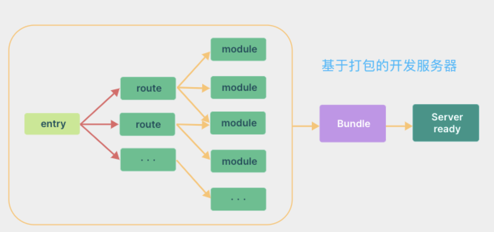
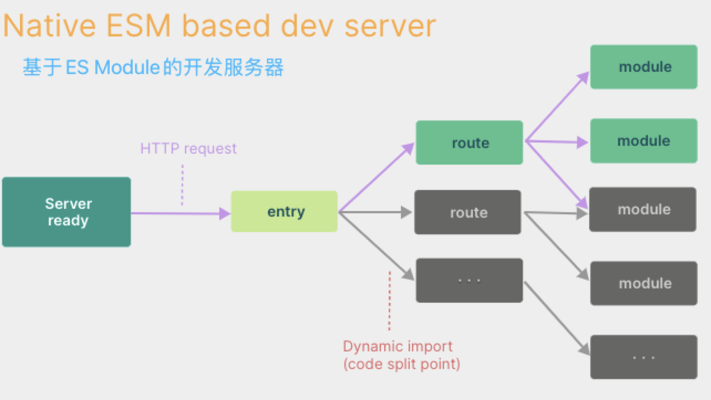

# Vite

Vite是一个现代化的前端构建工具，旨在提高开发人员的开发效率。它是一个轻量级的构建工具，使用ES Modules进行代码分割和构建，支持快速的开发和热更新。

Vite通过利用现代浏览器的原生ES模块加载功能来实现快速开发和构建。它采用了一种新的构建方式，称为“基于ESM的构建”（ESM-based builds）。这种构建方式将每个单独的文件视为一个独立的模块，通过ES Modules进行代码分割和构建。这使得Vite可以在**几乎没有构建过程**的情况下实现快速的开发和热更新。

Vite还支持TypeScript、JSX、CSS、Less、Sass等多种语言和框架，并通过插件机制支持更多的构建和开发场景。此外，Vite还具有自己的插件API，允许开发人员编写自己的插件来扩展Vite的功能。

Vite的另一个关键特性是其快速的热更新能力。在开发过程中，Vite可以快速地检测到代码的更改，并重新构建和重新加载应用程序。这使得开发人员可以更快地进行迭代开发，并在开发过程中快速看到其更改的效果。

## Vite 的特性

### 快速的服务器启动

当冷启动开发服务器时，基于打包器的方式启动必须优先抓取并构建你的整个应用，然后才能提供服务。

Vite 通过在一开始将应用中的模块区分为 **依赖** 和 **源码** 两类，改进了开发服务器启动时间。

- **依赖** 大多为在开发时不会变动的纯 JavaScript。一些较大的依赖（例如有上百个模块的组件库）处理的代价也很高。依赖也通常会存在多种模块化格式（例如 ESM 或者 CommonJS）。

Vite 将会使用 [esbuild 预构建依赖](https://cn.vitejs.dev/guide/dep-pre-bundling.html)。esbuild 使用 Go 编写，并且比以 JavaScript 编写的打包器预构建依赖快 10-100 倍。

- **源码** 通常包含一些并非直接是 JavaScript 的文件，需要转换（例如 JSX，CSS 或者 Vue/Svelte 组件），时常会被编辑。同时，并不是所有的源码都需要同时被加载（例如基于路由拆分的代码模块）。

Vite 以 [原生 ESM](https://developer.mozilla.org/en-US/docs/Web/JavaScript/Guide/Modules) 方式提供源码。这实际上是让浏览器接管了打包程序的部分工作：Vite 只需要在浏览器请求源码时进行转换并按需提供源码。根据情景动态导入代码，即只在当前屏幕上实际使用时才会被处理。

### 快速的更新

基于打包器启动时，重建整个包的效率很低。原因显而易见：因为这样更新速度会随着应用体积增长而直线下降。

在 Vite 中，HMR 是在原生 ESM 上执行的。当编辑一个文件时，Vite 只需要精确地使已编辑的模块与其最近的 HMR 边界之间的链失活（大多数时候只是模块本身），使得无论应用大小如何，HMR 始终能保持快速更新。

Vite 同时利用 HTTP 头来加速整个页面的重新加载（再次让浏览器为我们做更多事情）：源码模块的请求会根据 `304 Not Modified` 进行协商缓存，而依赖模块请求则会通过 `Cache-Control: max-age=31536000,immutable` 进行强缓存，因此一旦被缓存它们将不需要再次请求。

## 为什么生产环境仍需打包

尽管原生 ESM 现在得到了广泛支持，但由于嵌套导入会导致额外的网络往返，在生产环境中发布未打包的 ESM 仍然效率低下（即使使用 HTTP/2）。为了在生产环境中获得最佳的加载性能，最好还是将代码进行 tree-shaking、懒加载和 chunk 分割（以获得更好的缓存）。

要确保开发服务器和生产环境构建之间的最优输出和行为一致并不容易。所以 Vite 附带了一套 [构建优化](https://cn.vitejs.dev/guide/features.html#build-optimizations) 的 [构建命令](https://cn.vitejs.dev/guide/build.html)，开箱即用。
