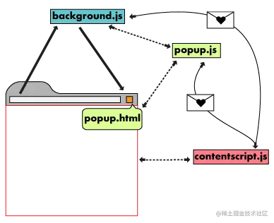

# Chrome 扩展开发

Chrome扩展是用于扩充Chrome浏览器功能的程序。

Chrome扩展主要用于对浏览器功能的增强，它更强调与浏览器相结合。比如Chrome扩展可以在浏览器的工具栏和地址栏中显示图标，它可以更改用户当前浏览的网页中的内容，也可以更改浏览器代理服务器的设置等等。

Chrome扩展是一系列文件的集合，这些文件包括**HTML文件**、**CSS样式文件**、**JavaScript脚本文件**、**图片等静态文件**以及 `manifest.json`。

> 插件是能通过『当前选项卡』『插件弹出页』『全局js脚本』『devtools信息』等合作通信去实现特定功能的后台程序。

## 插件基本组成结构



### manifest.json

扩展被安装后，Chrome就会读取扩展中的 `manifest.json` 文件。这个文件的文件名固定为 `manifest.json`，内容是按照一定格式描述的扩展相关信息，如扩展名称、版本、更新地址、请求的权限、扩展的UI界面入口等等。这样Chrome就可以知道在浏览器中如何呈现这个扩展，以及这个扩展如何同用户进行交互。

下面仅列举部分配置，完整配置清单见官方：[https://developer.chrome.com/docs/extensions/mv3/manifest/](https://developer.chrome.com/docs/extensions/mv3/manifest/)

```json
  {
  // Required
  "manifest_version": 3,  // V3 版本
  "name": "My Extension",  // 插件名称
  "version": "1.0.1",  // 插件版本
  "description": "A plain text description", // 插件描述
  "default_locale": "en",  // 默认语言

   // 用于配置点击插件图标后的浮层，popup.html 则是浮层的内容
  "action": {
     "default_title": "Click to view a popup",
   	 "default_popup": "popup.html"
   },

  "icons": {...},  // 插件图标配置
  "author": ...,  // 插件作者

  // `后台脚本`，该脚本不能访问DOM，只能通过 `消息传递` 与可以访问DOM的 `内容脚本` 进行通信
  "background": {
    "service_worker": "background.js",
  },

  // `内容脚本`，在网页中运行，可以访问DOM、获取页面上下文以及向页面中插入内容，通过 `消息传递` 与 `后台脚本` 进行通信
  "content_scripts": [
     {
       "matches": ["https://*.nytimes.com/*"],  // 指定此内容脚本被插入到哪些页面中
       "css": ["my-styles.css"],  // 要注入匹配页面的 CSS 文件列表
       "js": ["content-script.js"],  // 要注入匹配页面的 JavaScript 文件列表，按照数组的顺序注入
       "run_at": "document_idle", // 何时将 JavaScript 文件注入网页，可选址值：document_idle document_start document_end
     }
   ],

    // 使用/添加devtools中的功能
  "devtools_page": "devtools.html",

  "permissions": ["tabs"],
}
```

### 消息传递

由于内容脚本(content_script)在网页上下文而不是扩展程序的上下文中运行，因此它们通常需要某种方式与扩展程序的其余部分进行通信。

扩展程序及其内容脚本之间的通信通过使用消息传递进行。任何一方都可以侦听从另一端发送的消息，并在同一通道上响应。消息可以包含任何有效的 JSON 对象（null, boolean, number, string, array, object）。

有一个用于一次性请求的简单API和一个更复杂的API（它允许在共享上下文中交换多条消息的长连接。如果知道另一个扩展的ID，也可以向另一个扩展发送消息）。

#### 简单的一次性请求

如果只需要向扩展程序的另一部分(内容脚本或扩展)发送一条消息（并且可以选择返回响应），应该使用简化的 `runtime.sendMessage` 或 `tabs.sendMessage`。这可以将一次性 JSON 可序列化消息从内容脚本发送到扩展，反之亦然。可选的回调参数允许您处理来自另一侧的响应（如果有）。

